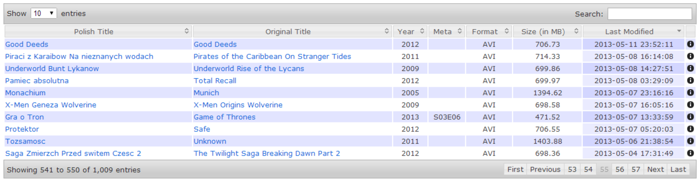

Movies Collector
================

Movies Collector is a small tool which builds a library of movies from local directory. It consists of two parts: a main collecting script which creates list of movies and a displayer which provides the list on a user-friendly HTML page.

## Script

Source code of the collector script can be found in the [collector](tree/master/collector) directory. The program written in Java is packed as a single JAR file and requires two parameters to execute:

1. a path to the root of movies directory
2. a path to the output JSON file (a file example: [movies.json](tree/master/catalogue/movies.json))

### Example of usage
```
java -jar movies-collector.jar /my/movies/root/directory/ output-movies-file.json
```

### Requirements
The only requirements for the script is a properly formatted file names. 

General the required format is:
```
Native.language.title_Original.language.title_YEAR_Comma.separated.metadata.extension
```
and it will be read by the script as following:

| Native Title          | Original Title          | Year | Metadata                 | Format    |
|-----------------------|-------------------------|:----:|:------------------------:|:---------:|
| Native language title | Original language title | YEAR | Comma separated metadata | EXTENSION |

Underscore chars separate four sections:

1. A movie title with your native language
2. An original movie's title
3. A premiere year
4. A metadata which contains some additional information about the movie

Dots separates words in each section.

## Displayer
The [catalogue](tree/master/catalogue) directory contains an example (in HTML with [DataTables](https://datatables.net/)) of how the JSON output file can be displayed for a simpler movies list review.



### The way to display information about movies

There are some special conditions in file names handled by the displayer. Some of them are described in bellow examples.

#### Example 1
```
Dziewczyna.z.tatuazem_The.Girl.with.the.Dragon.Tattoo_2011_AVI.avi
```
will be read as following:

| Native Title          | Original Title                  | Year | Metadata                 | Format |
|-----------------------|---------------------------------|:----:|:------------------------:|:------:|
| Dziewczyna z tatuazem | The Girl with the Dragon Tattoo | 2011 |                          |  AVI   |

When there is no any extra data to put in metadata section it is required to put there an uppercased file extension. It will be ignored by the script as displayed above.

#### Example 2 (for series)
```
Detektyw.S01E06_True.Detective_2014_S01E06.avi
```
will be read as following:

| Native Title | Original Title | Year | Metadata | Format |
|--------------|----------------|:----:|:--------:|:------:|
| Detektyw     | True Detective | 2014 |  S01E06  |  AVI   |